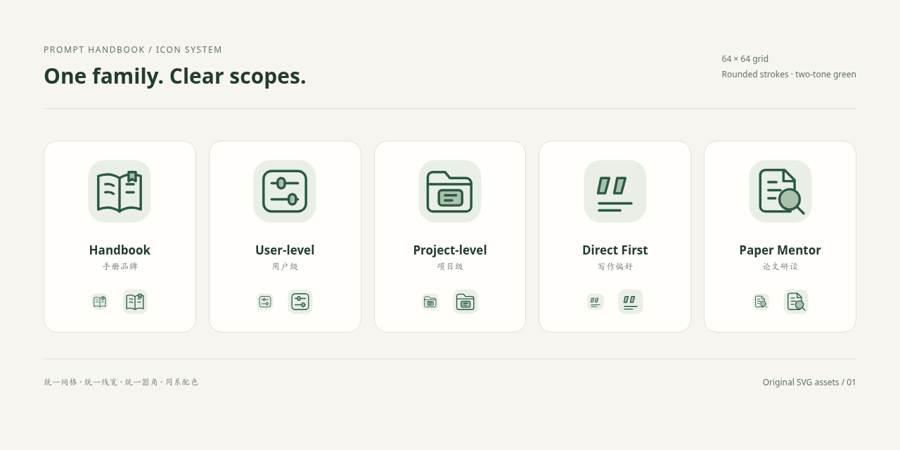

# Design system / 设计说明

## Direction

Prompt Handbook uses a quiet editorial interface: warm paper, deep green ink, restrained borders, generous spacing, and a clear browsing hierarchy. The homepage introduces two usage scopes; a scoped view removes repeated category cards so users reach prompts quickly. Detail pages keep the full prompt visible and show platform guidance beside it on wide screens, below it on smaller screens.

中文：延续 Direct First 的暖白与深绿，将单条提示词页面扩展为手册。分类、检索、正文与使用方法各自有明确位置；当前只呈现两个已支持的级别。

## Information architecture

```text
Prompt Handbook
├── User-level / 用户级
│   └── Direct First
├── Project-level / 项目级
│   └── Paper Mentor / 论文研读导师
└── Usage guide / 使用指南
```

Scope names describe intended placement. The optional project composer includes the two complete prompts explicitly; it does not change AI-service permissions or instruction priorities.

## Icon family



| Asset | Visual idea | Meaning |
|---|---|---|
| `handbook.svg` | Open book with a bookmark | The prompt collection |
| `user.svg` | Rounded preference panel and sliders | Durable personal defaults |
| `project.svg` | Folder containing a document | A focused workspace or workflow |
| `direct-first.svg` | Quotation-like strokes and writing lines | Writing style; continuity with the original mark |
| `paper-mentor.svg` | Research page and magnifying glass | Close reading and evidence inspection |

Production assets are editable vector drawings with a 64×64 canvas, rounded line caps and joins, approximately 2.4-unit strokes, and a shared cream / sage / deep-green palette. The separate tab icon uses a simpler book silhouette and slightly stronger strokes for small sizes. ICO contains 16, 32 and 48-pixel images; the Apple icon is 180×180 pixels.

Small navigation/action symbols share rounded stroke styling. The arrows mirror in RTL layouts; the brand remains left-to-right for a stable wordmark.

## Tokens and layout

Background `#f6f5f0`; paper `#fffefb`; primary ink `#243b30`; accent `#2c5745`; muted borders `#dce2d9`; soft surface `#eaf0e6`. Dark mode follows system preferences. Fonts are system fonts; no font files or external font requests are included.

Desktop uses a narrow navigation rail and a flexible content column. Detail pages add a compact guide column when space permits. Mobile uses wrapping scope buttons, stacked cards and readable full-width prompt text. Long text wraps instead of introducing horizontal scrolling.

## Interaction and access

Language choice is retained locally. Hash links encode the current scope or prompt, locale and optional combination; browser back/forward navigation is supported. The old Direct First language-only links continue to resolve to that prompt.

Actions include copy, a plain-text Markdown download, and share-link copy. On clipboard denial, a selected text box provides a manual fallback. Keyboard focus outlines, labelled controls, a skip link, live copy status and reduced-motion styles are included. These features have been checked locally; this is not a formal WCAG conformance claim.

Full text and translated instructions also live in the generated README, including for readers without JavaScript. No authentication, advertising, analytics, external scripts, runtime JSON fetches or backend services are included in the site code.

## Sharing asset

`assets/social-preview.png` is an original HTML-rendered title card at 1280×640 pixels. It is referenced by the site's Open Graph tags. GitHub repository social preview is a separate repository setting and is not changed by this package.
